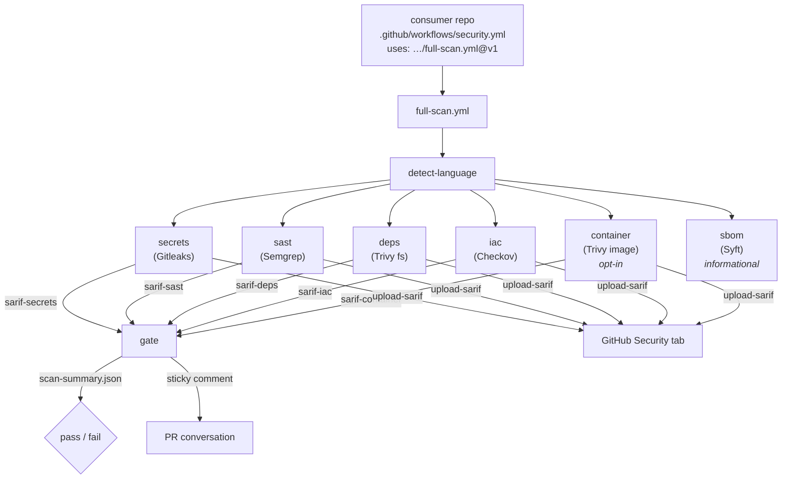

# Architecture

How the pipeline is composed, and why it's composed that way.

## The shape

Every scan stage is itself a reusable workflow (`secrets-scan.yml`, `sast.yml`,
`deps-scan.yml`, `iac-scan.yml`, `container-scan.yml`, `sbom.yml`) and can be
called independently. `full-scan.yml` is orchestration only: it owns the
dependency graph, fans the stages out in parallel, and runs the single `gate`
job at the end.

## Why reusable workflows (not actions, not composite actions)

Three mechanisms exist for shipping shared CI logic; reusable workflows win
for this use case:

- **Composite actions** run inside the caller's job. They can't define their
  own job graph, runners, containers, or `permissions`, so "run five scanners
  in parallel then gate" would collapse into one serial job with the
  caller's (usually too-broad) token.
- **JavaScript/Docker actions** are single steps. Wrapping five scanners
  means either one mega-action (unmaintainable, no parallelism) or five
  actions the consumer still has to orchestrate themselves — which is the
  problem we're solving.
- **Reusable workflows** bring their own jobs, parallelism, per-job
  least-privilege `permissions`, and container images, and the consumer
  integration is a single `uses:` line. The trade-offs (max nesting depth of
  4, artifacts as the only cross-job data channel) cost us nothing here.

One consequence worth understanding: a reusable workflow executes against the
**caller's** checkout. Our configs and scripts live in this repo, so every
stage resolves `${{ github.job_workflow_ref }}` (e.g.
`Just-In-N-Out/devsecops-pipeline/.github/workflows/sast.yml@refs/tags/v1`)
and checks this repo out at **that exact ref** into `.devsecops-pipeline/`.
Configs are therefore version-locked to the workflow version the consumer
pinned — a config change in `main` can never silently change the behavior of
a `@v1` consumer.

## Why SARIF as the exchange format

Every scanner speaks a different native format; SARIF is the one they all
also speak. Standardizing on it buys:

- **One classifier.** `severity-gate.sh` maps SARIF to severity tiers once,
  identically for all stages — no per-scanner parsing in the gate.
- **Security tab integration for free.** `github/codeql-action/upload-sarif`
  renders findings natively in GitHub's code-scanning UI, with per-stage
  `category` labels.
- **Swappable scanners.** Replacing Trivy with Snyk (or adding a new stage —
  see [extending.md](extending.md)) touches one workflow file; the gate,
  comment formatter, and Security tab never know the difference.

## Why one gate job instead of per-stage gating

Each stage *can* gate itself (and does when called standalone), but
`full-scan.yml` deliberately calls every stage with `fail-on-findings: false`
and decides pass/fail exactly once, in the `gate` job:

- **Complete picture.** Per-stage gating kills the run at the first failing
  stage; developers fix one finding, push, and discover the next stage's
  findings. The consolidated gate reports everything in one pass.
- **One policy point.** Threshold comparison, baseline subtraction, and
  advisory mode live in one script run in one place. Per-stage gating would
  evaluate policy six times with six chances to drift.
- **Honest failure semantics.** Scan jobs only show red when the *scanner
  itself* broke. The gate refuses to pass if any stage errored — missing
  data never looks like a clean scan.

## Why baseline-diff gating

Turning on a scanner in a mature repo surfaces hundreds of pre-existing
findings. If all of them block, every PR fails for reasons unrelated to its
diff — and teams respond by disabling the scanner. That's the inherited-debt
problem.

With `baseline-branch` set, the gate downloads the latest `scan-summary`
artifact from that branch and subtracts its findings (matched by a
`sha256(ruleId|file)` fingerprint — deliberately line-number-free so findings
survive rebases and unrelated edits). Only **new** findings gate the PR:
the debt is visible, tracked in the Security tab, and burned down on its own
schedule, while the PR bar stays "don't make it worse."

If no baseline artifact exists yet (first run), the gate warns and evaluates
all findings — fail-open on *data*, never on *policy*.

## Severity classification

The gate prefers the precise signal and falls back to the coarse one:

1. If the SARIF rule carries a `security-severity` score (CVSS-style, used
   by Trivy and Semgrep): ≥ 9.0 → critical, ≥ 7.0 → high, ≥ 4.0 → medium,
   else low.
2. Otherwise, the SARIF `level`: `error` → high, `warning` → medium,
   `note`/`none` → low.

The full block/warn matrix lives in [gating-policy.md](gating-policy.md).
